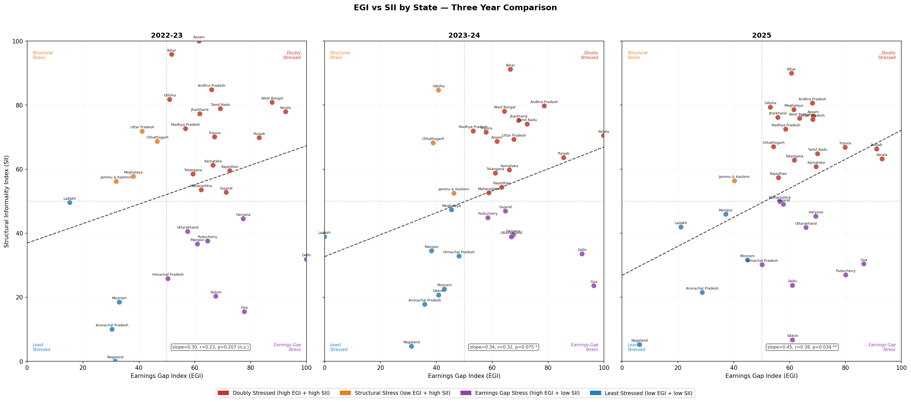

---
jupyter:
  kernelspec:
    display_name: Python 3
    language: python
    name: python3
  language_info:
    name: python
    version: 3.14.3
  nbformat: 4
  nbformat_minor: 5
---

::: {#e07bbcfb .cell .markdown}
# Informal Labour Market Stress Index (ILMSI)

### State-Level Analysis of Informal Worker Vulnerability in India

### Using PLFS 2022-23, 2023-24, and 2025

------------------------------------------------------------------------

## Overview

Macroeconomic indicators such as GDP and GVA do not directly address the
workforce employed in the informal sector, which includes workers with
no contractual jobs or social security.

This project contructs an **Informal Labour Market Stress Index
(ILMSI)** for 32 Indian States and Union Territories, using data from
the Periodic Labour Force Survey (PLFS) conducted by the MoSPI.

The index captures two dimensions of informal labour stress:

1\) Earnings Gap Index (EGI) Ratio of earnings gap between Informal
Workers and formal workers in the same state.

The ratio is taken between `wage_precarity`: casual worker monthly
earnings as a share of regular salaried worker earnings, and
`self_reg_ratio`: regular wage divided by self-employment earnings.
Higher ratio shows that self employment is a distress

2\) Structural Informality Index (SII) Measures how informal the market
structure is in itself, independent of wages.

The index is built from `casual_share`: share of workforce employed as
casual labourers, and `informality`: share of workers employed in
proprietary and partnership enterprises (this is MoSPI\'s standard
operational definition of the informal sector).

The composite **ILMSI** is the simple average of EGI and SII, giving
explicit equal weight to both dimensions. This is presented alongside
the two sub-indices rather than as a replacement for them, because a
state can score high on ILMSI for different reasons. Kerala\'s stress,
for example, is driven mostly by earnings gaps (given its well
established formal sector), while Bihar\'s is driven by structural
informality.

------------------------------------------------------------------------

## Key Visualisation

*Each point is one state in one year (2022-23, 2023-24, 2025). The
x-axis is the Earnings Gap Index and the y-axis is the Structural
Informality Index. The quadrant lines divide states into four structural
categories. The trendline shows the cross-state relationship between the
two dimensions within each year.*

------------------------------------------------------------------------

## Data Sources

PLFS Annual reports of the MoSPI were used from years 2022-23, 2023-24
and 2025. GVA Added at constant prices from the RBI Handbook of
Statistics was also used, alongside NREGA Job Card Coverage from the
NREGA MIS portal.

Raw PLFS Excel files are not included in this repository as they are
published by MoSPI and must be downloaded directly. See `data/README.md`
for exact table numbers, file naming conventions, and download links.

------------------------------------------------------------------------

## Methodology

### Step 1: Data Extraction

Nine PLFS tables were extracted for each of three survey years across 32
states and UTs. A custom parser reads MoSPI\'s fixed-width stacked
sub-table format, identifying and extracting the rural+urban combined
persons column from the final sub-table block in each file. The nine
tables used cover: Labour Force Participation Rate, Worker Population
Ratio, employment status distribution, industry of work (NIC-2008),
enterprise type, and wages for regular salaried, casual, and
self-employed workers.

Small UTs with unreliable PLFS sample sizes were excluded from index
construction.

### Step 2: The Variables

From the nine raw tables, four index variables were constructed:

  -------------------------------------------------------------------------
  Variable                Construction              Source Tables
  ----------------------- ------------------------- -----------------------
  `wage_precarity`        (casual daily wage × 30)  WAGE CASUAL, WAGE
                          / regular monthly wage    REGULAR

  `self_reg_ratio`        regular monthly wage /    WAGE REGULAR, WAGE SELF
                          self-employment monthly   
                          earnings                  

  `casual_share`          \% of workers classified  EMP STATUS
                          as casual labourers       

  `informality`           \% of workers in          ENTERPRISE
                          proprietary/partnership   
                          enterprises               
  -------------------------------------------------------------------------

Multiplying casual daily wages by 30 converts them to a monthly
equivalent before dividing by regular monthly wages, making the ratio
interpretable as a genuine earnings comparison rather than a
daily-to-monthly artefact.

### Step 3: Sub-Index Construction via PCA

Each pair of variables is fed into Principal Component Analysis
separately. PC1 is extracted and rescaled to 0--100, with orientation
adjusted so that higher scores always indicate more stress.

-   EGI: PC1 explains 78% of variance within (wage_precarity,
    self_reg_ratio)
-   SII: PC1 explains 66% of variance within (casual_share, informality)

Splitting into two sub-indices rather than running one PCA over all four
variables is a deliberate methodological choice. The two pairs measure
structurally different phenomena, earnings inequality versus labour
market composition, and combining them would produce a single score that
conflates states with high earnings gaps (Kerala) with states with high
casualisation (Bihar), obscuring the policy-relevant distinction between
them.

### Step 4: External Validation

Both sub-indices are validated using variables not used in their
construction, in simple OLS regressions at the state level:

**EGI is validated by two significant external predictors:**

  Predictor                               Direction   r        p-value
  --------------------------------------- ----------- -------- ---------
  Urbanisation rate (Census 2011)         Positive    +0.453   0.010
  Per capita GVA (RBI, constant prices)   Positive    +0.407   0.026

More urbanised and wealthier states have larger earnings gaps between
formal and informal workers, consistent with labour market dualism
theory. A large formal sector pulls regular wages up; informal workers
in the same economy earn relatively less.

**SII is validated by one significant external predictor:**

  Predictor                               Direction   r        p-value
  --------------------------------------- ----------- -------- ---------
  State literacy rate (PLFS Table 29.6)   Negative    −0.448   0.011

States with higher literacy have significantly lower structural
informality. Education enables access to formal employment, reduces
dependence on casual labour, and is associated with lower enterprise
informality rates.

Multiple regression specifications are directionally consistent but lose
individual significance at conventional thresholds given the small
cross-sectional sample of 31 states, a known constraint of state-level
analysis in India.

------------------------------------------------------------------------

## Key Findings

### The Four Quadrant Framework

Plotting EGI against SII for each state-year reveals four structurally
distinct types of informal labour stress:

**Doubly Stressed with high EGI and high SII** Bihar, West Bengal,
Assam, Andhra Pradesh. Large earnings gaps and highly casual, informal
labour structures simultaneously. These states need both earnings-side
and formalisation-side policy intervention.

**Earnings Gap Stress with high EGI and low SII** Kerala, Goa, Delhi,
Punjab. Relatively fewer casual workers but the formal-informal earnings
gap is enormous. Policy implication would be to do minimum wage
enforcement and casual wage legislation here. This pattern also reflects
labour market dualism rather than general poverty.

**Structural Stress with low EGI and high SII** Odisha, Jharkhand,
Madhya Pradesh, Uttar Pradesh. Highly informal labour market structures
but the formal sector is small enough that wages are not much higher
than informal earnings. Formalisation policy implications here are that
incentives and social security extension should be prioritised.

**Least Stressed with low EGI and low SII** Nagaland, Arunachal Pradesh,
Ladakh, Mizoram, Sikkim. Small formal sectors mean the formal-informal
wage gap is compressed. These states are not necessarily wealthy in
absolute terms but their informal workers face less relative deprivation
because the gap itself is smaller.

### Specific State-Level Findings

**Kerala** scores highest on EGI in all three years. Its large public
sector and remittance-backed formal economy push regular wages very
high, creating an enormous earnings gap for informal workers. SII is
moderate because casualisation rates are not the country\'s highest.
Kerala\'s stress is a dualism problem, not an informality-volume
problem.

**Punjab** shows the clearest deteriorating trajectory across the three
years, moving toward doubly-stressed by 2025. Agricultural mechanisation
is reducing casual labour demand while formal sector wages rise,
widening the earnings gap for those who remain in informal work.
Agricultural distress is becoming labour market distress.

**Odisha** shows shifting from structural stress toward doubly stressed
across all three years. Both its earnings gap and its structural
informality seem to be worsening.

**Bihar** anchors the high-SII end throughout. It has the highest
structural informality in the country across all years, reflecting its
large agricultural casual labour force and the near-absence of formal
private sector employment. Its EGI is moderate because Bihar\'s formal
sector wages are not dramatically above the national average.

### The Time Trend

The entire distribution shifts rightward along the EGI axis. states\'
earnings gaps are widening. This is consistent with post-COVID formal
sector wage recovery outpacing informal sector earnings recovery. formal
wages bounced back faster after 2021-22 while casual and self-employment
earnings remained suppressed.

------------------------------------------------------------------------

## Limitations

**Short panel.** Three time periods limits the statistical power of
within-state analysis. The time trend findings are descriptive rather
than causal.

**2025 methodology change.** MoSPI revamped the PLFS sampling design
from January 2025 onwards, shifting from a July-June survey cycle to a
January-December cycle and expanding rural coverage. MoSPI itself
cautions against direct comparison with earlier rounds. The 2025 data is
retained but treated cautiously in time trend analysis.

**HOURS variable unavailable at state level.** State-level data on hours
available for additional work a direct underemployment measure could not
be extracted from 2022-23 and 2023-24 files because those rounds report
this variable only at the all-India level in the published tables.

**Cross-sectional validation sample.** With 31-32 states, multiple
regression validation loses power quickly. Simple bivariate regressions
are the most reliable validation results in this context.

**Relative rather than absolute measurement.** Both sub-indices measure
stress relative to each state\'s own formal sector. A state where
everyone earns little but equally will score low on EGI even if absolute
wages are very low. Relative deprivation within a labour market is the
theoretically relevant concept for informality stress, but it should be
kept in mind when interpreting the Northeast states\' low scores.
:::
